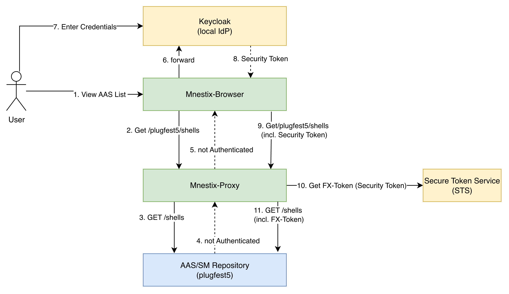

<!-- SPDX-License-Identifier: MIT -->
<!-- Copyright (c) 2025 XITASO GmbH -->
<h1 style="text-align: center">Mnestix Proxy</h1>

[](https://xitaso.com/)
[](https://choosealicense.com/licenses/mit/)
[](https://xitaso.com/kompetenzen/mnestix/#support)

### This is a fork for Factory-X ###
Original repository: https://github.com/eclipse-mnestix/mnestix-proxy

This proxy is used to handle the token exchange as described here: https://factory-x.atlassian.net/wiki/spaces/TP4/pages/587104261/Increment+2+Trusted+List

The proxy sits between the client and the AAS repository. Testing was performed using Eclipse Mnestix Browser as the AAS client and the AAS Package Explorer Server as AAS repository.



### Quick Start ###

Start the entire stack with a single command:

```bash
docker compose up -d
```

This will build and start all services. The first start may take a few minutes due to the Keycloak image build (Maven compilation).

### Available Services ###

| Service | URL | Description |
|---------|-----|-------------|
| Mnestix Browser | http://localhost:3000 | AAS web UI |
| Mnestix Proxy | http://localhost:5065 | Reverse proxy with token exchange |
| Keycloak | http://localhost:8080 | Identity provider (Admin: `admin` / `admin`) |
| Keycloak (HTTPS) | https://localhost:8443 | Keycloak HTTPS endpoint |
| MongoDB | (internal only) | Database backend for BaSyx |
| BaSyx AAS Environment | (internal only) | AAS repository |

### Demo Walkthrough ###

- After starting up the proxy, you can test it via your browser:
  - get all shells from [plugfest5](https://plugfest5.aas-voyager.com/api/v3.0/) by calling: http://localhost:5065/plugfest5/shells
  - get all submodels from [plugfest5](https://plugfest5.aas-voyager.com/api/v3.0/) by calling: http://localhost:5065/plugfest5/submodels
  - HINT: try calling https://plugfest5.aas-voyager.com/api/v3.0/submodels directly and you will not get e.g. the HandoverDocumentation submodels because of missing credentials.
- Open your browser and navigate to http://localhost:3000
    - Click "GO TO AAS LIST".
    - If you do not have a Authorization header in the request, the proxy will return HTTP Status "401 - not authenticated" (This is for demo and testing purposes.)
      - You get a hint in the Mnestix Browser: "Authentication needed"
      - click "Login" to get forwarded to Keycloak (running at http://localhost:8080)
      - Authenticate in keycloak with these credentials (this user is allowed to see all submodels of plugfest5)
        - Username: aorzelski@phoenixcontact.com
        - Password: aorzelski@phoenixcontact.com-secret
      - You get your token in the Authorization header
      - You will get a nice visualization of all the AASs from plugfest5 via the Mnestix-Proxy.
    - You can click an AAS and see all the details including all submodels.

### Stop ###

```bash
docker compose down
```

### For Developers ###
The implementation for Factory-X is mainly done in the file: [FXTransformProvider.cs](mnestix-proxy/Authentication/TokenExchange/FXTransformProvider.cs)


The first step is to store the address of the FAAAST AAS repository in [appsettings.json](mnestix-proxy/appsettings.json):

```json
 "ReverseProxy": {
    "Routes": {
      "EnvironmentRoute": {
        "ClusterId": "plugfest5",        
        "Match": {
          "Path": "plugfest5/{**catch-all}"
        },
        "Transforms": [
          {
            "PathPattern": "/{**catch-all}"
          },
          {
            "ResponseHeader": "Access-Control-Allow-Origin",
            "Set": "*"
          }
        ]
      }
    },
    "Clusters": {      
      "plugfest5": {
        "Destinations": {
          "destination1": {
            "Address": "https://plugfest5.aas-voyager.com/api/v3.0/"
          }
        }
      }
    }
```

The second step is to configure the Security Token Service (STS):
```json
 "TokenExchange": {
    "EnableTokenExchange": "true",
    "SecureTokenExchangeService": {
      "TokenExchangeUrl": "https://iam-security-training.com/consumer/sts/token"
    }
  },
```

This means that you only need to specify the address of the proxy as the AAS server in the infrastructure settings of the Mnestix browser.

In the [compose.yml](compose.yml) the default repository of Mnestix Browser is configured to the test repo *plugfest4*

```json
 services:
  mnestix-browser:
    container_name: mnestix-browser
    image: mnestix/mnestix-browser:2.0.0
    profiles: ['', 'frontend', 'tests']   
    ports:
      - '3000:3000'
    environment:
      AAS_REPO_API_URL: 'http://localhost:5065/plugfest5'
      SUBMODEL_REPO_API_URL: 'http://localhost:5065/plugfest5'
      CONCEPT_DESCRIPTION_REPO_API_URL: 'http://localhost:5065/plugfest5'
      SERIALIZATION_API_URL: 'http://localhost:5065/plugfest5'
```


-------------------------------

### Welcome to the Mnestix Community!

The Mnestix Proxy is an open source component that acts as a secure and flexible gateway between your applications and Asset Administration Shell (AAS) data sources. Developed under the guidance of XITASO, 
a high-end software development company specializing in the engineering domain.

The Proxy facilitates seamless communication between clients and AAS repositories or Discovery Services. It supports routing of AAS API requests, making it easier to manage, monitor, and secure your AAS infrastructure.
Whether you're building Digital Twins, implementing a Digital Product Passport (DPP), or working in distributed AAS environments, the Proxy is your ideal companion.

### Build Requirements (SDK 8)

- **SDK**: Builds are pinned to **.NET SDK 8** via [global.json](global.json). This ensures consistent results across machines and CI.
- **Target framework**: The proxy targets **net8.0** as configured in [mnestix-proxy/mnestix-proxy.csproj](mnestix-proxy/mnestix-proxy.csproj).
- **Docker**: Container builds use `mcr.microsoft.com/dotnet/sdk:8.0` and runtime `mcr.microsoft.com/dotnet/aspnet:8.0` as defined in the [Dockerfile](Dockerfile).

Quick checks:

```bash
dotnet --version   # should print 8.0.x
dotnet build mnestix-proxy/mnestix-proxy.csproj -c Debug
```

If the 8.0 SDK is not installed, the `dotnet` CLI will prompt accordingly. Install from https://dotnet.microsoft.com/download/dotnet/8.0.

### Kubernetes Deployment (Helm)

The Helm setup has been moved to `../helm`.

Use the dedicated chart documentation in `../helm/README.md`.
